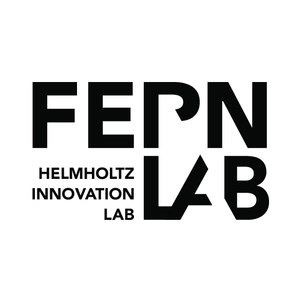

Tutorial
========

This tutorial refers to this FERN.Lab version of cookiecutter FastAPI package, which is a fork of `cookiecutter`_.

To start with, you will need access to GitHub or GitLab, depending on where you want to keep your package.
If you want to publish on PyPi you need an account on `PyPI`_. Create these before you get started on this tutorial. If you are new to Git and GitHub, you should probably spend a few minutes on some of the tutorials at the top of the page at `GitHub Help`_.

.. _`PyPI`: https://pypi.python.org/pypi
.. _`GitHub Help`: https://help.github.com/
.. _`cookiecutter`: https://github.com/audreyfeldroy/cookiecutter-pypackage

FastAPI Python Package
======================
This manual explains how to create a directory structure for a Python-FastAPI project using the **Cookiecutter** template from **FERNLab**.

Furthermore, it also explains how to create a GitLab repository for that package and deploy it as a service using **Docker**.

1. Install the pre-requirements
2. Generate a FastAPI API directory structure
3. Testing the generated directory
4. Prepare Gitlab repository
5. Create and attach a runner to the repository
6. Maintaining and extending the project

**Please Note** The following instruction is for **Ubuntu 20.04**.

1. Install the pre-requirements
-------------------------------
Before generating generating your own directory using this template, you need to have

* **Git** version ``2.28`` or higher
* **Cookiecutter** version ``1.4.0`` or higher 
* **Miniforge Conda**

to be installed on your machine.

1.1. Git
~~~~~~~~
First check to see if you already have **git** on your machine by doing 

.. code-block:: bash

    git --version

If **git** is not found on your machine, it could be installed easily by doing

.. code-block:: bash

    sudo apt-get update
    sudo apt install git-all

If you have **git** but it has version older than ``2.28``, you could upgrade it by

.. code-block:: bash

    sudo add-apt-repository ppa:git-core/ppa
    sudo apt update
    sudo apt-get upgrade -y git

1.2. Cookiecutter
~~~~~~~~~~~~~~~~~
To install cookiecutter, you can use **pip** as follow:

.. code-block:: bash

    # Install using pip
    pip install -U cookiecutter
    # Check installed version
    cookiecutter --version

1.3. Miniforge
~~~~~~~~~~~~~~
**Miniforge** is the light version of Conda that is used for managing the python environment for each python package you are working on. Using **Miniforge**, you can have different python environment with different python packages and version for specific project.

Based on `official conda-forge documentation <https://github.com/conda-forge/miniforge?tab=readme-ov-file#install>`_, you can use one of the following scripts to install **Miniforge** on your machine:

.. code-block:: bash

    # Using curl
    curl -L -O "https://github.com/conda-forge/miniforge/releases/latest/download/Miniforge3-$(uname)-$(uname -m).sh"
    bash Miniforge3-$(uname)-$(uname -m).sh

    # or using wget
    wget "https://github.com/conda-forge/miniforge/releases/latest/download/Miniforge3-$(uname)-$(uname -m).sh"
    bash Miniforge3-$(uname)-$(uname -m).sh

Once you installed it, you need to close the terminal and reopen it. Then do

.. code-block:: bash

    mamba env list

and you will see

.. code-block:: bash
    
    # conda environments:
    #
    base                  *  /home/arash/miniforge3

which is the base environment automatically created by **mamba** during the installation.

More information can be found on [their github repository](https://github.com/conda-forge/miniforge).

    Now you have everything you need for generating python package directory.

2. Generate a FastAPI API directory structure
---------------------------------------------

2.1. Clone the source code
~~~~~~~~~~~~~~~~~~~~~~~~~~

You can clone the repository from https://github.com/FernLab/cookiecutter-fastapi-package by doing

.. code-block:: bash
   
    git clone https://github.com/FernLab/cookiecutter-fastapi-package.git

2.2. Generate the directory by setting parameters
~~~~~~~~~~~~~~~~~~~~~~~~~~~~~~~~~~~~~~~~~~~~~~~~~

Cookiecutter provides you with a command line interface (CLI) to interact with it to customize your python project directory.

Once you cloned the repository, make sure that you are in the parent directory of the cloned repository because cookiecutter looks for it to generate the directory. Then by doing

.. code-block:: bash

    cookiecutter cookiecutter-fastapi-package

You are asked by multiple questions as follow

.. code-block:: bash

    [1/15] full_name (FERN.Lab): 
    [2/15] email (fernlab@gfz-potsdam.de): 
    [3/15] github_username (fernlab): 
    [4/15] gitlab_group_or_username (fernlab): 
    [5/15] gitlab_subgroup_name (): 
    [6/15] project_name (FastAPI Boilerplate): 
    [7/15] project_slug (fastapi_boilerplate): 
    [8/15] project_short_description (FastAPI Boilerplate contains all the boilerplate you need to create a FastAPI Python package.): 
    [9/15] pypi_username (fernlab): 
    [10/15] version (0.1.0): 
    [11/15] use_precommit (n): 
    [12/15] add_pyup_badge (n): 
    [13/15] Select command_line_interface
      1 - Argparse
      2 - No command-line interface
      Choose from [1/2] (1): 
    [14/15] create_author_file (y): 
    [15/15] Select open_source_license
      1 - EUPL-1.2
      2 - MIT
      3 - BSD-3-Clause
      4 - ISC
      5 - Apache-2.0
      6 - GPL-3.0-or-later
      7 - NOASSERTION
      Choose from [1/2/3/4/5/6/7] (1):

which are explained here:

+-------+---------------------------+-----------------------------------------------------------------------------------------------+ 
| Step  | Field Name                | Default                                                                                       | 
+=======+===========================+===============================================================================================+ 
| 1     | full_name                 | FERN.Lab                                                                                      |
+-------+---------------------------+-----------------------------------------------------------------------------------------------+ 
| 2     | email                     | fernlab@gfz-potsdam.de                                                                        |
+-------+---------------------------+-----------------------------------------------------------------------------------------------+ 
| 3     | github_username           | fernlab                                                                                       |
+-------+---------------------------+-----------------------------------------------------------------------------------------------+ 
| 4     | gitlab_group_or_username  | fernlab                                                                                       |
+-------+---------------------------+-----------------------------------------------------------------------------------------------+ 
| 5     | gitlab_subgroup_name      |                                                                                               |
+-------+---------------------------+-----------------------------------------------------------------------------------------------+ 
| 6     | project_name              | FastAPI Boilerplate                                                                           |
+-------+---------------------------+-----------------------------------------------------------------------------------------------+ 
| 7     | project_slug              | fastapi_boilerplate                                                                           |
+-------+---------------------------+-----------------------------------------------------------------------------------------------+ 
| 8     | project_short_description | FastAPI Boilerplate contains all the boilerplate you need to create a FastAPI Python package. |
+-------+---------------------------+-----------------------------------------------------------------------------------------------+ 
| 9     | pypi_username             | fernlab                                                                                       |
+-------+---------------------------+-----------------------------------------------------------------------------------------------+ 
| 10    | version                   | 0.1.0                                                                                         |
+-------+---------------------------+-----------------------------------------------------------------------------------------------+ 
| 11    | use_precommit             | n                                                                                             |
+-------+---------------------------+-----------------------------------------------------------------------------------------------+ 
| 12    | add_pyup_badge            | n                                                                                             |
+-------+---------------------------+-----------------------------------------------------------------------------------------------+ 
| 13    | command_line_interface    | 1                                                                                             |
+-------+---------------------------+-----------------------------------------------------------------------------------------------+ 
| 14    | create_author_file        | y                                                                                             |
+-------+---------------------------+-----------------------------------------------------------------------------------------------+ 
| 15    | open_source_license       | 1                                                                                             |
+-------+---------------------------+-----------------------------------------------------------------------------------------------+ 

    Note: Depending on your project choose the appropriate License. For most of the projects it is recommended option 1), the EUPL License. Could be changed later on if necessary.

3. Testing the generated directory
----------------------------------

The purpose of this step is to make sure if the directory was generated successfully, before pushing the codes to the GitLab repository and creating the corresponding runner.

To do that, the template provides some commands.

.. code-block:: bash

    cd <project_slug>
    mamba env create -f tests/CI_docker/context/environment_<project_slug>.yml
    mamba activate <project_slug>
    pip install .
    make pytest
    make lint
    make urlcheck
    make docs

which are respectively for testing the whole package, lint style, urls, and documentation.

4. Prepare Gitlab repository
----------------------------

After making sure that project has been successfully created, we need to create a blank gitlab repository and push the generated directory structure to it. To achieve this, follow these steps:

4.1 Create repository using Web UI
~~~~~~~~~~~~~~~~~~~~~~~~~~~~~~~~~~

On gitlab website, under the sub-group you want:

* Create a new project by clicking on **New project**
* Click on **Create blank project**
* Give a **project name** at your choice
* For the **project slug** pick the same name as the one given once you created directory at step 7 (check table above)
* It's very important to unset the option ``Initialize repository with a README``
* Click on **Create project**

4.2. Push the repository
~~~~~~~~~~~~~~~~~~~~~~~~

Once you created the blank repository, follow the instructions to push the directory to the remote repository.

They are summarized here:

.. code-block:: bash

    cd <project_slug>
    git init --initial-branch=main
    git remote add origin git@git.gfz-potsdam.de:<group/subgroup/project_slug>.git
    git add .
    git commit -m "Initial commit"
    git push -u origin main

Now on you browser, refresh the page to see the repository.

In the above code, the group is our directory in the gitlab (here is fernlab) and the subgroup is the text comes between the group and the project_name name.

5. Create and attach a runner to the repository
-----------------------------------------------

Login to a mefe machine you like to deploy the runner using your gfz email id (i.e.  ``<email-id>@gfz-potsdam.de``) and your master password:

.. code-block:: bash

    ssh <email-id>@<mefe-name>

Pull the repository to the mefe machine by executing following commands:

.. code-block:: bash

    cd /misc/fernlab1/misc/
    git clone https://git.gfz-potsdam.de/<group/subgroup/project_slug>.git

When you're asked by credential, use your gfz email id and your master password.

    Remember! Clone with ssh (``git clone git@github.com:...``) is not working here and you need to use HTTPS as mentioned above.

Then build the runner by executing following commands:

.. code-block:: bash
    
    cd <project_slug>/tests/CI_docker
    chmod 755 build_<project_slug>_testsuite_image.sh
    ./build_<project_slug>_testsuite_image.sh

This will start building a docker image which will be the CI runner docker image.

Once it is built it will ask for a token. To get token, on gitlab follow steps below:

* Go to **Settings** > **CI/CD** > **Runners**.
* Blow the Project runners, click on **New Project Runner**.
  * Leave Tags empty
  * Activate option ``Run untagged jobs``. 
  * Activate option ``Lock to current project``.
  * Set a timeout if needed (can be left empty to use the default, can be changed later)
* Click on **Create runner**.
* Please copy the token you are getting.
* On mefe console, paste the token and pres enter.
* Then you will be asked for a name for the runner. It is recommended to follow this nomenclature:

``<package_name>_CI__v<package_version>__<mefe_machine>``

In this naming style:
- ``package_version``: since it is the first runner the version is ``0.1.0``
- ``mefe_machine``: in our example ``mefe4``

you can also add your name or a short version so people know who this runner belongs to.

Once you press enter, go to **Settings** > **CI/CD** > **Runners**. The runner will be listed here and you should now be able to see a pipeline running.

6. Maintaining and extending the project
----------------------------------------

6.1. Adding new packages
~~~~~~~~~~~~~~~~~~~~~~~~

6.2. Developing tests
~~~~~~~~~~~~~~~~~~~~~

6.3. Having trouble?
~~~~~~~~~~~~~~~~~~~~

Go to our `Issues`_ page and create a new Issue. Be sure to give as much information as possible.

.. _`Issues`: https://github.com/FernLab/cookiecutter-fastapi-package/issues

Developed by
============

  
This FastAPI package boilerplate has been developed by `FERN.Lab <https://fernlab.gfz-potsdam.de/>`_, the Helmholtz Innovation Lab "Remote sensing for sustainable use of resources", located at the `Helmholtz Centre Potsdam, GFZ German Research Centre for Geosciences <https://www.gfz-potsdam.de/en/>`_. FERN.Lab is funded by the `Initiative and Networking Fund of the Helmholtz Association <https://www.helmholtz.de/en/about-us/structure-and-governance/initiating-and-networking/>`_.
